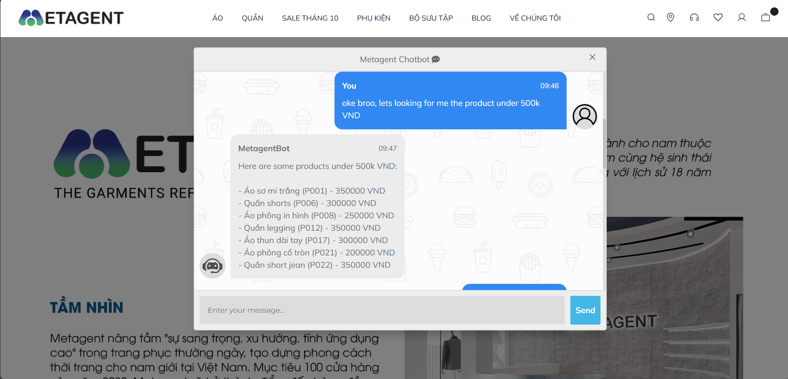
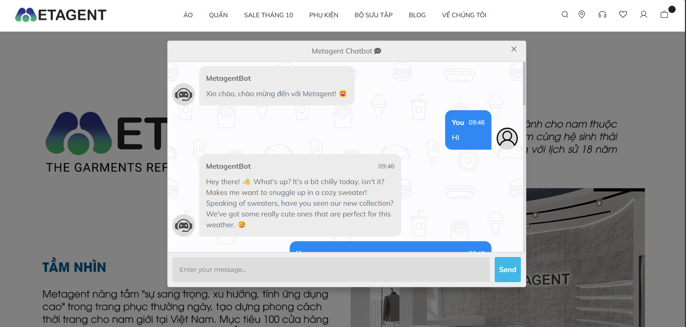

<h1 align="center">ShoppingGPT🌼</h1>

<p align="center">
  
</p>
 
ShoppingGPT is an AI-powered intelligent shopping assistant that combines advanced natural language processing techniques to deliver a smart and seamless shopping experience. Built with a focus on performance, scalability, and user experience, ShoppingGPT integrates cutting-edge technologies to revolutionize e-commerce interactions.

## Features ✨

- 🧠 **Large Language Models (LLMs)**: Leverages the power of Google's Gemini model for natural, context-aware conversations.
- 📚 **RAG (Retrieval-Augmented Generation)**: Enhances responses with relevant product information from SQLite database, ensuring accurate and up-to-date product details.
- 🛣️ **Semantic Router**: Intelligently routes queries to the appropriate handling mechanism using advanced embedding techniques.
- 🔍 **Advanced Product Search**: Utilizes case-insensitive and partial matching capabilities, powered by efficient SQLite queries and indexing.
- 💬 **Intelligent Chatbot Interface**: User-friendly chat interface designed for intuitive product queries and personalized recommendations.


## System Architecture

ShoppingGPT employs a modular, scalable architecture:

1. **User Interface (Flask Web App)**
   - Handles user input and displays responses

2. **Semantic Router**
   - Utilizes GoogleGenerativeAIEmbeddings
   - Classifies and routes user queries to appropriate handlers

3. **Query Handlers**
   a. **Chitchat Chain**
      - Manages general conversation
      - Leverages LLM (Gemini-1.5-flash) and ConversationBufferMemory
   
   b. **Shopping Agent**
      - Processes product-related queries
      - Employs various tools:
        - Product Search Tool (SQLite-based)
        - Policy Search Tool (FAISS-based)

4. **Data Storage**
   - SQLite database for product information
   - FAISS vector store for policy information

5. **External Services**
   - Google Generative AI API for LLM and embeddings

This architecture enables efficient query routing, context-aware responses, and seamless integration of product and policy information into the conversation flow.


### Key Components

- **RAG System**: Combines FAISS vector store for policy information and SQLite for product data, ensuring fast and relevant information retrieval.
- **LLM Integration**: Utilizes `ChatGoogleGenerativeAI` with the Gemini-1.5-flash model to generate human-like responses.
- **Product Search**: Implements a robust `ProductDataLoader` class for efficient SQLite query execution and result formatting.
- **Policy Search**: Uses FAISS for fast similarity search on company policies and guidelines.

## Advanced Routing and Classification 🧭

ShoppingGPT utilizes advanced routing and classification techniques to enhance its performance:

1. **Semantic Router**: We implement the [Semantic Router](https://github.com/aurelio-labs/semantic-router) library for efficient query routing. This allows for superfast decision-making and intelligent processing of multi-modal data.

2. **Cosine Similarity**: The system employs cosine similarity algorithm to measure the semantic similarity between user queries and predefined routes, ensuring accurate classification and routing.

3. **Custom Hugging Face Model**: We use a fine-tuned Hugging Face model specifically trained for classifying text as either chitchat or product-related. This model enhances the accuracy of query classification.

## Model 🧠

The text classification model used in this project is available on Hugging Face:

[hang1704/opendaisy](https://huggingface.co/hang1704/opendaisy)

This model is used for classifying user queries and enhancing the overall performance of ShoppingGPT. Feel free to explore and use it in your own projects!


## Data Structure 🗂️

Product data is stored in SQLite and includes the following fields:

- `product_code`: Unique identifier (TEXT)
- `product_name`: Name of the product (TEXT)
- `material`: Material composition (TEXT)
- `size`: Available sizes (TEXT)
- `color`: Available colors (TEXT)
- `brand`: Manufacturer or seller (TEXT)
- `gender`: Target gender (TEXT)
- `stock_quantity`: Quantity in stock (INTEGER)
- `price`: Product price (REAL)

## Installation 🛠️

To set up ShoppingGPT:

1. **Clone the repository**:
    ```bash
    git clone https://github.com/yourusername/ShoppingGPT.git
    cd ShoppingGPT
    ```

2. **Create and activate a virtual environment**:
    ```bash
    python -m venv venv
    source venv/bin/activate  # On Windows, use `venv\Scripts\activate`
    ```

3. **Install dependencies**:
    ```bash
    pip install -r requirements.txt
    ```

4. **Configure environment**:
   Create a `.env` file in the root directory:
   ```
   GOOGLE_API_KEY=your_google_api_key
   ```

5. **Initialize the database**:
    ```bash
    python scripts/init_db.py
    ```

## Usage 🖥️

To start ShoppingGPT:

1. **Run the Flask application**:
   ```bash
   python app.py
   ```

2. **Access the chatbot**:
   Open your web browser and navigate to `http://localhost:5000`.

3. **Interact with ShoppingGPT**:
   - Ask about products: "What red shirts do you have in stock?"
   - Inquire about policies: "What's your return policy?"
   - General chat: "How's the weather today?"

## Project Showcase 📸


*Our user-friendly chat interface*



*Example of product search results*



*Friendly conversation with our AI assistant*


These images showcase the key aspects of our ShoppingGPT project. From the intuitive chat interface to the powerful product search and easy access to policy information, our AI assistant is designed to enhance your shopping experience! 🛍️🤖

## Customization 🛠️

To customize ShoppingGPT for your specific needs:

1. **Update product database**: Modify `data/products.db` with your inventory.
2. **Adjust policies**: Edit `data/policy.txt` with your company's guidelines.
3. **Fine-tune responses**: Modify prompt templates in `shoppinggpt/tool/product_search.py` and `shoppinggpt/tool/policy_search.py`.

## Troubleshooting 🔍

If you encounter any issues:

1. Ensure all environment variables are correctly set.
2. Check the console for any error messages.
3. Verify that the database and policy files are in the correct locations.
4. Make sure all required dependencies are installed correctly.
5. Confirm that you're using a compatible Python version (3.7+).

For more detailed information, please refer to the documentation or open an issue on the GitHub repository.

## Contributing 🤝

We welcome contributions to ShoppingGPT! Here's how you can help:

1. Fork the repository
2. Create a new branch (`git checkout -b feature/AmazingFeature`)
3. Make your changes
4. Commit your changes (`git commit -m 'Add some AmazingFeature'`)
5. Push to the branch (`git push origin feature/AmazingFeature`)
6. Open a Pull Request

Please make sure to update tests as appropriate and adhere to the project's coding standards.


## License 📄

This project is licensed under the MIT License - see the [LICENSE](LICENSE) file for details.

## Acknowledgments 👏

- Thanks to all contributors who have helped shape ShoppingGPT
- Special thanks to the open-source community for providing amazing tools and libraries

Happy shopping with ShoppingGPT! 🛍️🤖